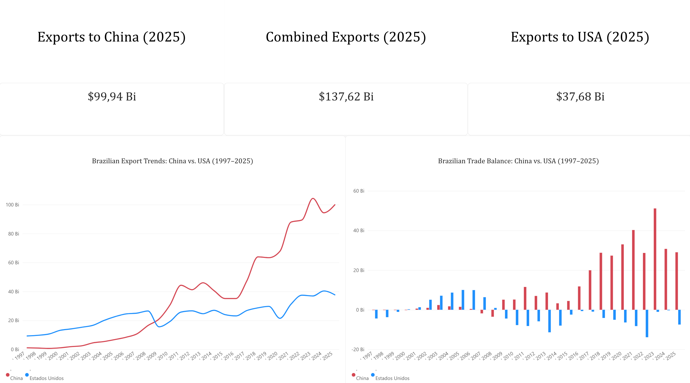

Brazilian Trade Balance Analysis: China vs. US (1997–2025)

An end-to-end data analytics project examining historical trade dynamics between Brazil and its top two global economic partners, covering data extraction and modeling via SQL to executive dashboard design and storytelling in Power BI.

---

Business Context & Objectives

* Objective: Map structural shifts in Brazilian foreign trade across nearly three decades, highlighting the 2009 tipping point and China's consolidation as Brazil’s primary export market and source of net foreign exchange reserves.
* Tech Stack: SQL (data extraction, conditional aggregation, metric engineering), Power BI (DAX modeling, dashboard design, executive storytelling).
* Data Source: Official Brazilian open foreign trade microdata via Comex Stat.

---

Data Pipeline & Modeling (SQL)

The original dataset contained granular transactional records by flow, commodity, and trade partner. SQL queries were built to consolidate annual time series, applying conditional aggregation (`CASE WHEN`) to split export/import flows and calculating the structural **Trade Balance** metric directly at the database level:

```sql
SELECT "Ano",
"Países",
SUM(CASE WHEN "Fluxo" LIKE '%Exportação%' THEN "Valor US$ FOB" ELSE 0 END) AS total_exportacao,
SUM(CASE WHEN "Fluxo" LIKE '%Importação%' THEN "Valor US$ FOB" ELSE 0 END) AS total_importacao,
SUM(CASE WHEN "Fluxo" LIKE '%Exportação%' THEN "Valor US$ FOB" ELSE 0 END) -
SUM(CASE WHEN "Fluxo" LIKE '%Importação%' THEN "Valor US$ FOB" ELSE 0 END) AS saldo_comercial
FROM V_EXPORTACAO_E_IMPORTACAO_GERAL veeig
GROUP BY
"Ano",
"Países"
ORDER BY
"Ano" DESC,
"Países";
SELECT "Ano",
SUM(CASE WHEN "Países" LIKE '%CHINA%' AND "FLUXO" LIKE '%Export%' THEN "Valor US$ FOB" ELSE 0 END) AS export_china,
SUM(CASE WHEN "Países" LIKE '%Estados Unidos%' AND "Fluxo" LIKE '%Export%' THEN "Valor US$ FOB" ELSE 0 END) AS export_eua,
SUM(CASE WHEN "Países" LIKE '%CHINA%' AND "FLUXO" LIKE '%Export%' THEN "Valor US$ FOB" ELSE 0 END) -
SUM(CASE WHEN "Países" LIKE '%Estados Unidos%' AND "Fluxo" LIKE '%Export%' THEN "Valor US$ FOB" ELSE 0 END) AS diferenca_china_vs_eua
FROM V_EXPORTACAO_E_IMPORTACAO_GERAL veeig
GROUP BY "Ano"
ORDER BY "Ano" ASC;
CREATE VIEW IF NOT EXISTS vw_balanca_comercial_anual AS
SELECT "Ano",
"Países",
SUM(CASE WHEN "Fluxo" LIKE '%Export%' THEN "Valor US$ FOB" ELSE 0 END) AS total_exportacao,
SUM(CASE WHEN "Fluxo" LIKE '%Import%' THEN "Valor US$ FOB" ELSE 0 END) AS total_importacao,
SUM(CASE WHEN "Fluxo" LIKE '%Export%' THEN "Valor US$ FOB" ELSE 0 END) -
SUM(CASE WHEN "Fluxo" LIKE '%Import%' THEN "Valor US$ FOB" ELSE 0 END) AS saldo_comercial
FROM V_EXPORTACAO_E_IMPORTACAO_GERAL veeig
GROUP BY "Ano",
"Países"
ORDER BY "Ano" ASC,
"Países";

```

2. Executive Dashboard: The dashboard was structured around executive visual hierarchy, eliminating chart junk and enabling immediate analytical interpretation.


   

# Key Strategic Insights:

  *Brazilian exports to China reached $99.94B, nearly triple the $37.68B destined for the United States.

  * Consolidated bilateral export volume totaled $137.62B.

The 2009 Structural Tipping Point:

  * The historical line chart illustrates the market reversal following the 2008 global financial crisis, driven by the global commodities supercycle and Chinese industrial demand overtaking traditional US dominance.

Structural Trade Balance Disparity:

  * While commercial flows with the US oscillate near equilibrium (with cyclical deficits), trade with China consistently delivers double-digit billion-dollar annual surpluses, cementing Asia as Brazil's chief foreign exchange engine.
